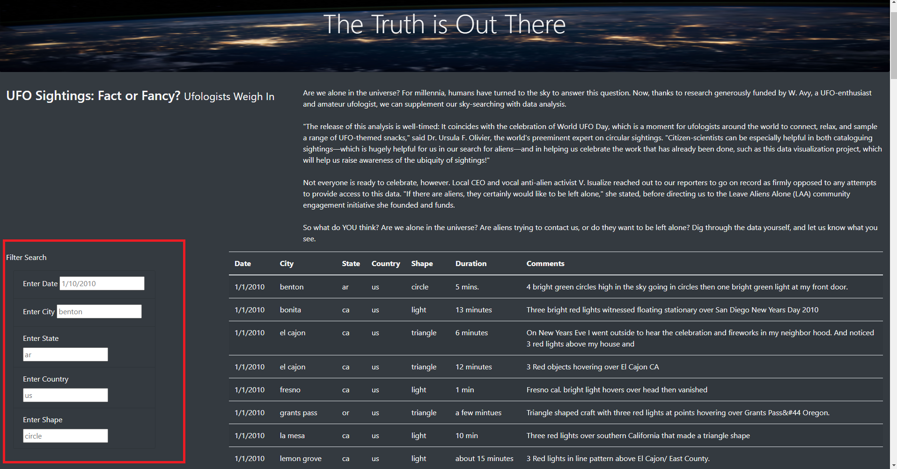
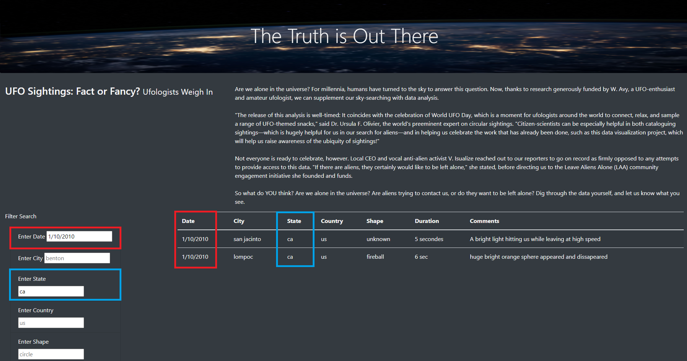

# UFO Finder 

## Resources 
JavaScript, HTML, CSS 

Challenge codes:
* [app.js](static/js/app.js)
* [data.js](static/js/data.js)
* [style.css](static/css/style.css)
* [index.html](index.html)

## Overview of the Analysis
In depth analysis of UFO sightings for users by allowing the data in a dynamic table to be filtered for multiple criteria on Dana's website. Additional filters were added for the date, city, state, country, and shape in regards to UFO sightings.  

## Review 
To perform a search, locate the Filter Search location on the webpage. See Step 1 image below for where it is located based on the red box. Next, input the criteria for the data to be filtered by. See Step 2 image below where a date of "1/10/2010" was entered (red) and the state "ca" was entered (blue) to filter the data; press the Enter key. Once the filtered data has been observed, delete the filter entries and press the Enter key to refresh the table or reload the page altogether.

**Step 1**

**Step 2**

## Summary 

One drawback of this webpage is the lack of flexibility in the filters applied for this data. For example, users may want to choose UFO sightings between 2 specific dates or they may want to observe the different kind of sightings in separate states. Since this option is not available, the user will need perform multiple searches to acquire the data required. 

An additional recommendation for the webpage is to address the drawback listed above: to allow users to apply more than one entry per filter option. A second recommendation will be to include an option for users to submit their own UFO sightings directly on the webpage. This will include adding a new section for users to input their own data and having a submit button which will add their entry to the website/data file with all sightings.
